# LegalSteward - Visual Diagrams

This document contains Mermaid diagrams for visualizing the LegalSteward architecture and workflows.

---

## 1. System Architecture Diagram

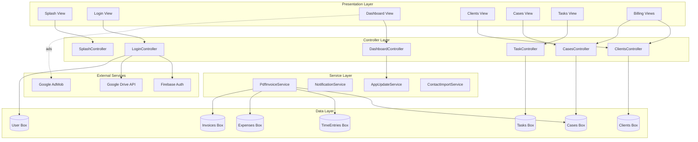

---

## 2. Entity Relationship Diagram

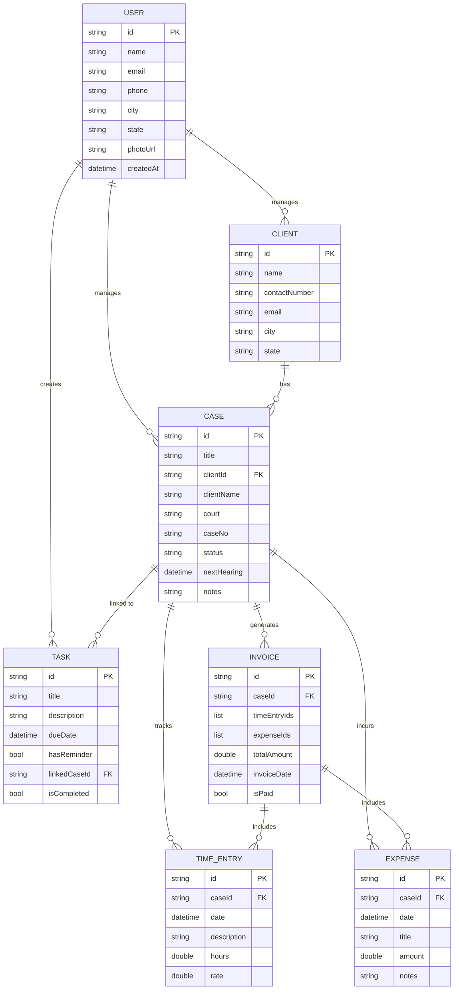

---

## 3. Application Flow Diagram

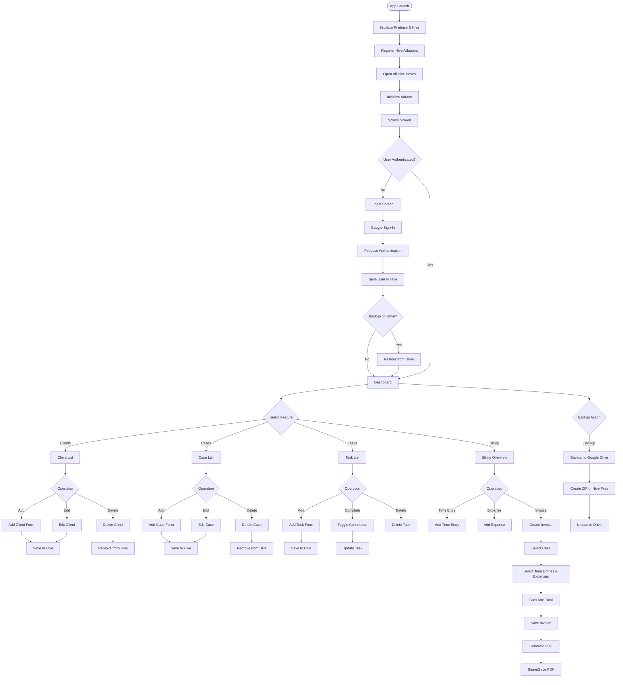

---

## 4. Data Flow - Client Management

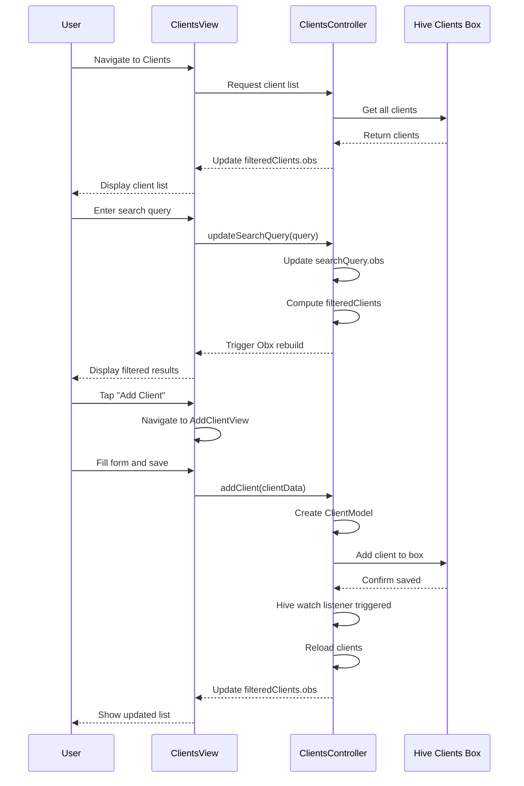

---

## 5. Data Flow - Invoice Generation

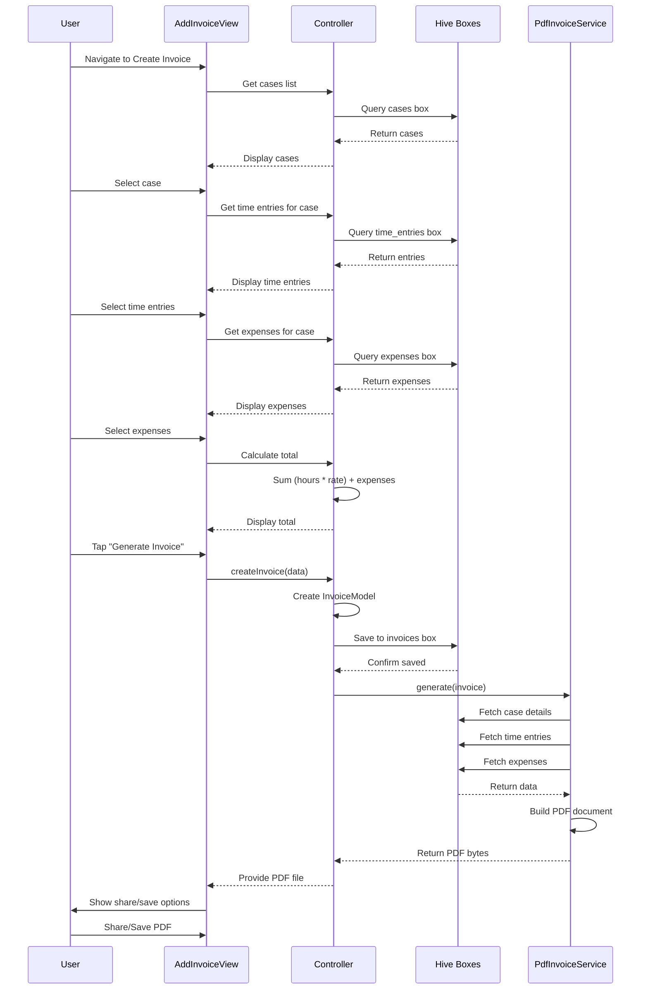

---

## 6. Authentication Flow

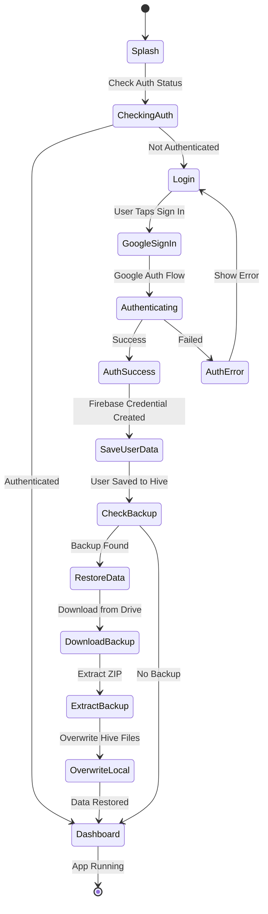

---

## 7. Backup & Restore Flow

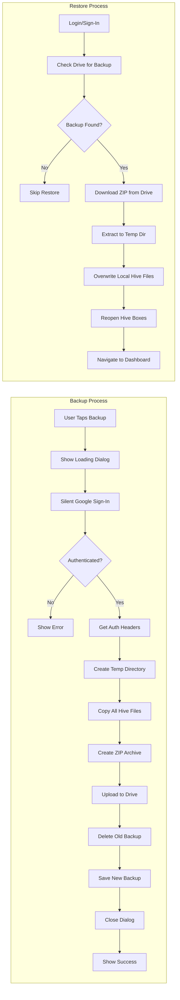

---

## 8. Task Management State Machine

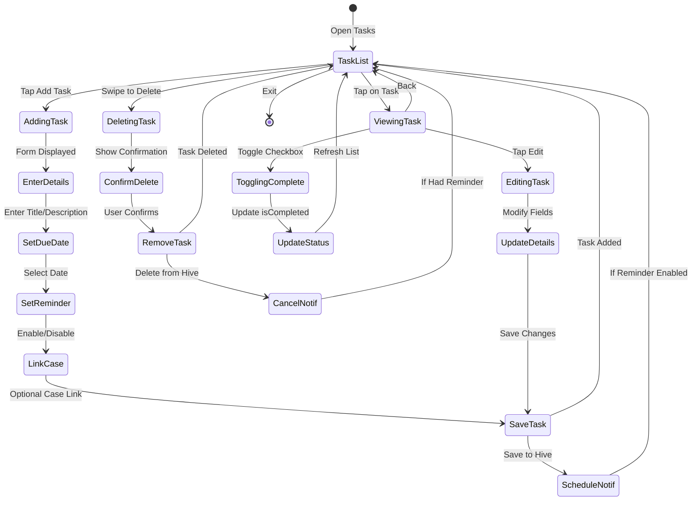

---

## 9. Case Lifecycle

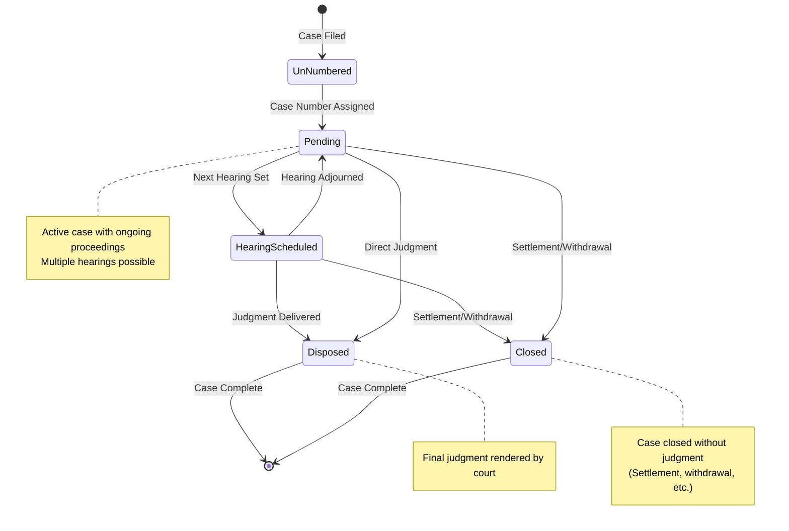

---

## 10. Controller Reactive Pattern

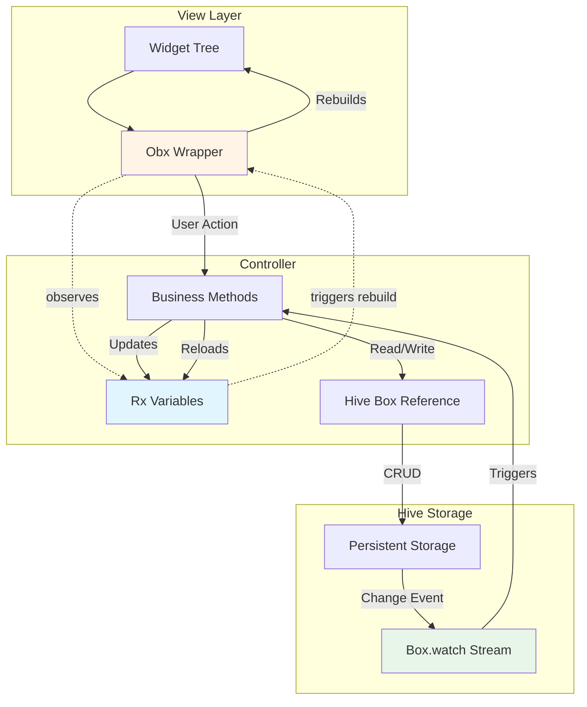

---

## 11. Module Dependency Graph

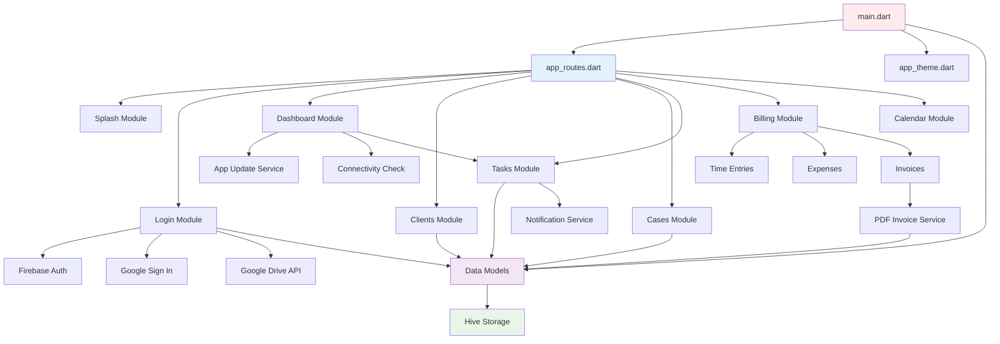

---

## 12. Search & Filter Flow

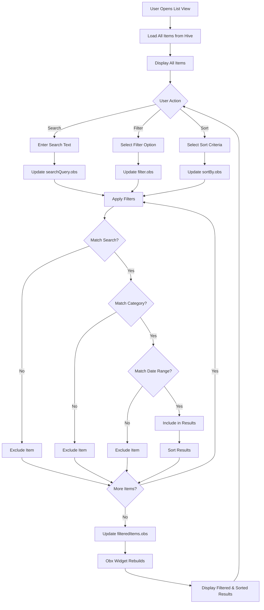

---

## 13. Service Layer Architecture

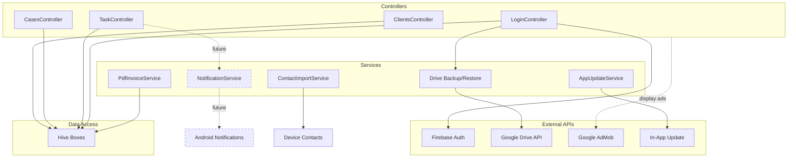

---

## 14. Billing Workflow Detail

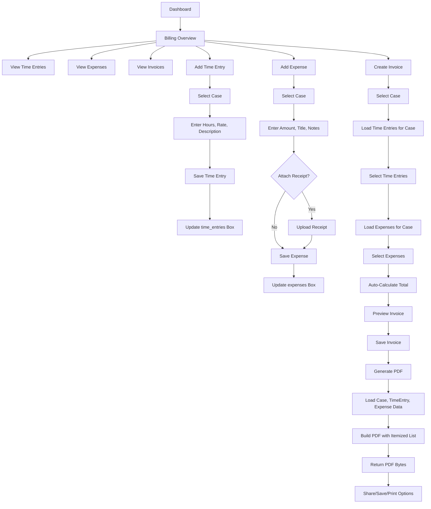

---

## 15. Hive Box Initialization

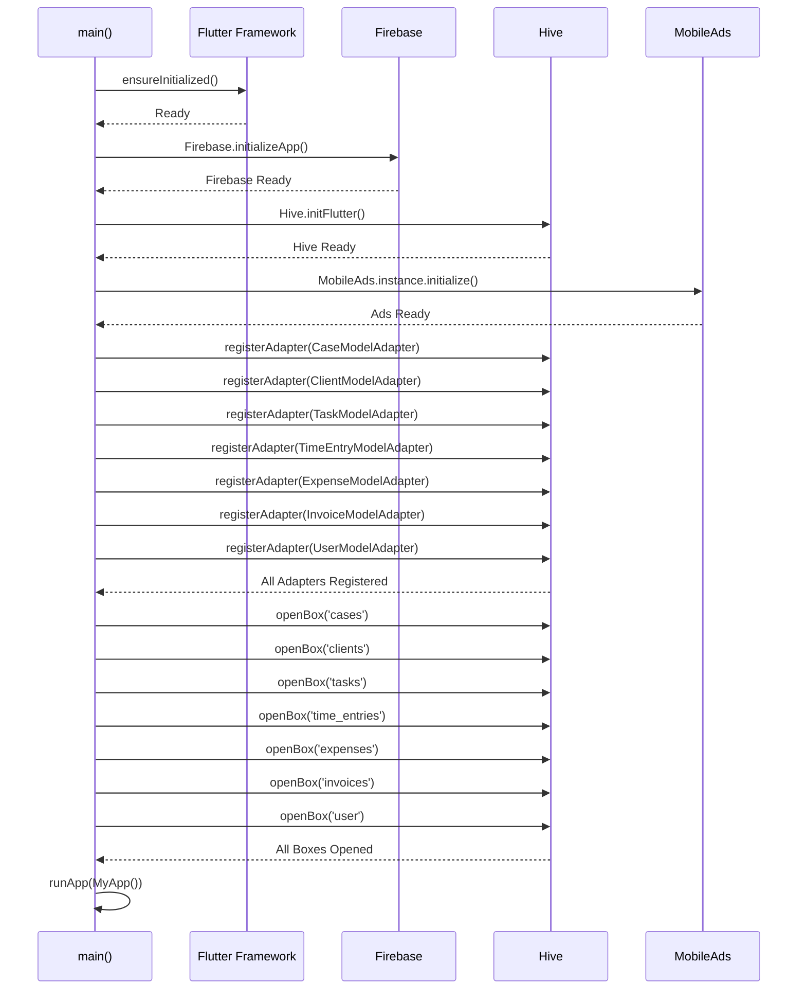

---

## 16. Error Handling Flow

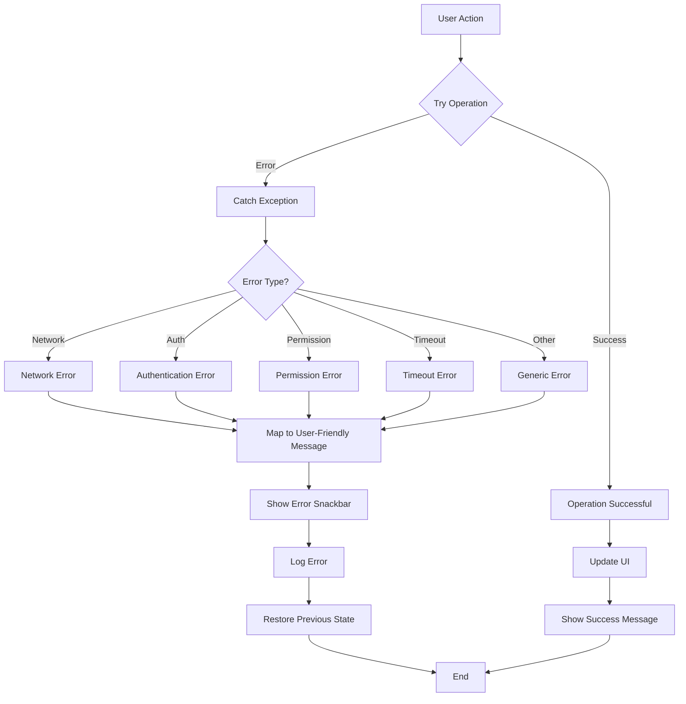

---

## Conclusion

These diagrams provide visual representations of:
- System architecture and module relationships
- Data models and entity relationships
- User workflows and application flows
- State management patterns
- Service interactions
- Authentication and backup processes

Use these diagrams in conjunction with the ProjectAnalysis.md document for a complete understanding of the LegalSteward application architecture and workflows.
